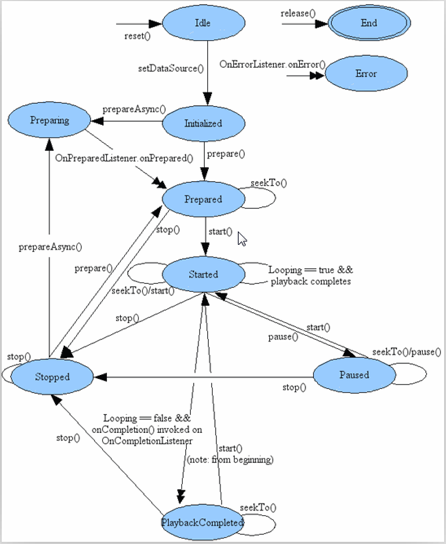

#MediaPlayer和VideoView
Android 系统中提供给开发真开发多媒体应用（音视频）方面。 
一、MeidaPlayer是负责和底层打交道，解码的是底层，封装了很多方法start,pause,stop，播放视频的类。 
这个MediaPlayer可以播放本地和网络的音视频，播放网络音视频的时候要获取网络权限。 
1、执行流程 : 
2、视频支持的格式：MP4/sgp/m3u8(直播) 

二、VideoView 
显示视频，继承于SurfaceView类，实现MediaPlayerControl接口，封装了MediaPlayer的start,pause,stop，本质上是使用MediaPlayer.

SurfaceView默认使用双缓存技术，它支持在子线程中绘制图像，这样就不会阻塞主线程所以它更适合于游戏和视频开发。 
实现MediaPlayerControl接口，便于控制面板调用VideoView

    public interface MediaPlayerControl {
        void    start();
        void    pause();
        int     getDuration();
        int     getCurrentPosition();
        void    seekTo(int pos);
        boolean isPlaying();
        int     getBufferPercentage();
        boolean canPause();
        boolean canSeekBackward();
        boolean canSeekForward();

        /**
         * Get the audio session id for the player used by this VideoView. This can be used to
         * apply audio effects to the audio track of a video.
         * @return The audio session, or 0 if there was an error.
         */
        int     getAudioSessionId();
    }

#Activity的生命周期和横竖屏切换的生命周期

一、生命周期

    1、创建Activity的时候执行的方法
	oncreate->onStart->onResume
    2、销毁Activity的时候执行的方法
	onPause->onStop->onDestory

二、A页面B页面，点击返回，这个过程中的生命周期
    
    (1)B页面完全覆盖A页面的情况
    A跳转B页面的生命周期方法执行顺序：
	onPause(A)->onCreate(B)->onStart(B)->onResume(B)->onStop(A)
	注：不执行onDestory(A)方法，所以在使用Intent跳转到其他页面的时候要使用finish()方法，这样A才会执行onDestory()。此时可创建一个ActiviyCollector类管理多个Activity
    
    B页面点击后返回生命周期执行顺序：
	onPause(B)->onRestart(A)->onStart(A)->onResume(A)->onStop(B)-onDestory(B)
	注：按back键返回会调用onDestory()
    

    (2)B页面不完全覆盖A页面的请求(将B页面设置为对话框形式)
    A跳转B页面的生命周期方法执行顺序
	onPause(A)->onCreate(B)->onStart(B)->onResume(B)

    B页面点击后返回生命周期执行的顺序
	onPause(B)->onResume(A)->onStop(B)->onDestory(B)

#Activity横竖屏切换的生命周期
    默认情况：onPause->onStop->onDestory->onCreate->onStart->onResume
	屏蔽横竖屏切换：
	在配置清单文件(AndroidManifest.xml)中的<Activity />如下配置
	<activity
            android:name=".activity.SystemVideoPlayer"
            android:configChanges="orientation|screenSize|keyboardHidden"
            ></activity>

#全屏模式
    android:theme="@android:style/Theme.NoTitleBar.Fullscreen"

#findViewById离线使用
findViewById离线使用脚本快速实例化控件

#视频Seekbar更新
    1、视频的总时长和SeekBar的setMax(总时长)
	注：在准备好了的监听获取	

    2、实例化Handler,每秒得到当前视频播放进度，SeekBar.setProgress(当前进度)

#SeekBar的拖动
    1、视频的总时长和SeekBar的setMax(总时长)
	注：在准备好了的监听获取	

	2、设置SeekBar的状态改变监听

#横竖屏切换
    1、配置文件配置
	android:screenOrientation="landscape"<!--横屏-->
	android:screenOrientation="portrait"<!--竖屏-->
    
    2、编码方式
	public void switchOrientation(View view){
        //获取屏幕方向
        int orientation = getResources().getConfiguration().orientation;
        if(orientation == Configuration.ORIENTATION_PORTRAIT) {
            setRequestedOrientation(ActivityInfo.SCREEN_ORIENTATION_LANDSCAPE);
        }else {
            setRequestedOrientation(ActivityInfo.SCREEN_ORIENTATION_PORTRAIT);
        }
    }
	/*********/
	@Override
    public void onConfigurationChanged(Configuration newConfig) {
        super.onConfigurationChanged(newConfig);
        int orientation = newConfig.orientation;
        if(orientation == Configuration.ORIENTATION_PORTRAIT) {
            Toast.makeText(OrientationActivity.this, "竖屏", Toast.LENGTH_SHORT).show();
        }else {
            Toast.makeText(OrientationActivity.this, "横屏", Toast.LENGTH_SHORT).show();
        }
    }
    
#注册广播有两种方式:静态注册和动态注册
    1、静态注册：在功能清单文件中注册，只要软件安装在手机上，就算软件不启动，也能收到对应的广播；
	注：并不是所有的广播都可以静态注册，例如电量变化、锁屏、等
    2、动态注册：只有注册的代码被执行后，才能收到对应的广播
	//注册广播
        mReceiver = new MyBroadcastReceiver();
        IntentFilter filter = new IntentFilter();
        filter.addAction(Intent.ACTION_BATTERY_CHANGED);
        registerReceiver(new MyBroadcastReceiver(),filter);
	
		class MyBroadcastReceiver extends BroadcastReceiver{

        @Override
        public void onReceive(Context context, Intent intent) {
            int level = intent.getIntExtra("level", 0);//获取电量
            //设置
            setBattery(level);
        }
    }
	//解注册广播
	@Override
    protected void onDestroy() {
        if(mReceiver != null) {
            unregisterReceiver(mReceiver);
            mReceiver = null;
        }
        super.onDestroy();
    }
	注：一般情况下，创建资源时先执行创建父类的资源；释放资源时，先释放子类的资源

#传递列表数据到Activity中，列表中的数据有可能是对象或int等基本数据类型
    注：传递数据时要将对象序列化，Parcelable和Serializable

#Parcelable和Serializable的区别
    Android自定义对象课序列化有两个选择，一个是Serializable，另一个是Parcelable。

	一、对象为什么需要序列化
	1、永久性保存对象，保存对象的字节序列到本地文件。
	2、通过序列化对象在网络中传递数据。
	3、通过序列化对象在进程间传递对象。

	二、当对象需要被序列化是如何选择所使用的接口
	1、在使用内存的时候Parcelable比Serializable的性能要高。
	2、Serializable在序列化的时候会产生大量的临时变量，从而引起频繁的GC（内存回收）。
	3、Parcelable不能使用在将对象存储在磁盘上的这种情况，因为在外界的变化下Parcelable不能很好的保证数据的持续性。

#手势识别器
    1、定义
	
	2、实例化
	重写 双击，单击，长按

	3、onTouchEvent(),方法中把事件传递给手势识别器
    
    
	
    